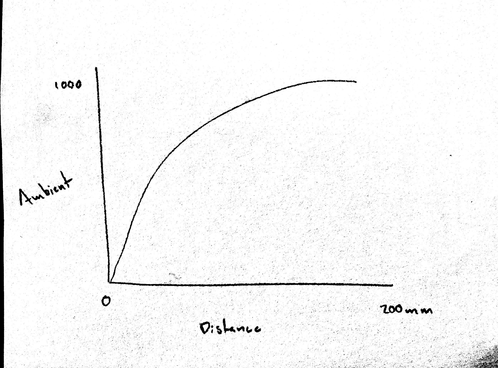
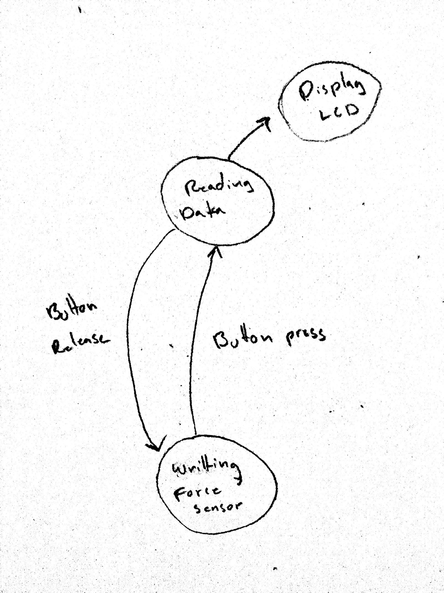

# Data Logger (and using cool sensors!)

*A lab report by John Q. Student.*

## In The Report

Include your responses to the bold questions on your own fork of [this lab report template](https://github.com/FAR-Lab/IDD-Fa18-Lab2). Include snippets of code that explain what you did. Deliverables are due next Tuesday. Post your lab reports as README.md pages on your GitHub, and post a link to that on your main class hub page.

For this lab, we will be experimenting with a variety of sensors, sending the data to the Arduino serial monitor, writing data to the EEPROM of the Arduino, and then playing the data back.

## Part A.  Writing to the Serial Monitor
 
**a. Based on the readings from the serial monitor, what is the range of the analog values being read?**

0 to 1023
 
**b. How many bits of resolution does the analog to digital converter (ADC) on the Arduino have?**

1023 resolution

## Part B. RGB LED

**How might you use this with only the parts in your kit? Show us your solution.**

You could map the force sensor readings to a LED color.

## Part C. Voltage Varying Sensors 
 
### 1. FSR, Flex Sensor, Photo cell, Softpot

**a. What voltage values do you see from your force sensor?**

I was able to get up to 575.

**b. What kind of relationship does the voltage have as a function of the force applied? (e.g., linear?)**

I think it's a log relationship.

**c. Can you change the LED fading code values so that you get the full range of output voltages from the LED when using your FSR?**

You can map the voltage from the input sensor to the min and max values of the LED.

**d. What resistance do you need to have in series to get a reasonable range of voltages from each sensor?**

220 Ohms.

**e. What kind of relationship does the resistance have as a function of stimulus? (e.g., linear?)**

Log relationship.

### 2. Accelerometer
 
**a. Include your accelerometer read-out code in your write-up.**

```c++
// Basic demo for tap/doubletap readings from Adafruit LIS3DH

#include <Wire.h>
#include <SPI.h>
#include <Adafruit_LIS3DH.h>
#include <Adafruit_Sensor.h>

#include "Adafruit_VCNL4010.h"

Adafruit_VCNL4010 vcnl;

// Used for software SPI
#define LIS3DH_CLK 13
#define LIS3DH_MISO 12
#define LIS3DH_MOSI 11
// Used for hardware & software SPI
#define LIS3DH_CS 10

// software SPI
//Adafruit_LIS3DH lis = Adafruit_LIS3DH(LIS3DH_CS, LIS3DH_MOSI, LIS3DH_MISO, LIS3DH_CLK);
// hardware SPI
//Adafruit_LIS3DH lis = Adafruit_LIS3DH(LIS3DH_CS);
// I2C
Adafruit_LIS3DH lis = Adafruit_LIS3DH();

#if defined(ARDUINO_ARCH_SAMD)
// for Zero, output on USB Serial console, remove line below if using programming port to program the Zero!
   #define Serial SerialUSB
#endif

void setup(void) {
#ifndef ESP8266
  while (!Serial);     // will pause Zero, Leonardo, etc until serial console opens
#endif

  Serial.begin(9600);
    Serial.println("Adafruit LIS3DH ADC Test!");
  
  if (! lis.begin(0x18)) {   // change this to 0x19 for alternative i2c address
    Serial.println("Couldnt start");
    while (1);
  }
  Serial.println("LIS3DH found!");
  
  lis.setRange(LIS3DH_RANGE_2_G);   // 2, 4, 8 or 16 G!
  
  Serial.print("Range = "); Serial.print(2 << lis.getRange());  
  Serial.println("G");
  
}


void loop() {
  int16_t adc;
  uint16_t volt;
  
  sensors_event_t event; 
  lis.getEvent(&event);
  
  Serial.print(" X: "); Serial.print(event.acceleration.x);
  Serial.print(" Y: "); Serial.print(event.acceleration.y);
  Serial.print(" Z: "); Serial.print(event.acceleration.z);
  Serial.println();
    
  delay(1000);
}
```

### 3. IR Proximity Sensor

**a. Describe the voltage change over the sensing range of the sensor. A sketch of voltage vs. distance would work also. Does it match up with what you expect from the datasheet?**



**b. Upload your merged code to your lab report repository and link to it here.**

[Accelerometer + Proximity](Accelerometer\ copy/src/main.ino)

## Optional. Graphic Display

**Take a picture of your screen working insert it here!**

## Part D. Logging values to the EEPROM and reading them back
 
### 1. Reading and writing values to the Arduino EEPROM

**a. Does it matter what actions are assigned to which state? Why?**

No it does not. You can assign any action to any state. 

**b. Why is the code here all in the setup() functions and not in the loop() functions?**

In ```SwitchState2.ino``` most of the code is in ```loop()```. This is because the program must continually read from the potentiometer in order to change the state of the program.

**c. How many byte-sized data samples can you store on the Atmega328?**

1024 bytes of data in the EEPROM of the Atmega328.

**d. How would you get analog data from the Arduino analog pins to be byte-sized? How about analog data from the I2C devices?**

You could map the range of the analog data from 0 to 2^8 = 256.

**e. Alternately, how would we store the data if it were bigger than a byte? (hint: take a look at the [EEPROMPut](https://www.arduino.cc/en/Reference/EEPROMPut) example)**

If you wanted to add a piece of data large than a byte, for example a  ```float```, you could use the ```put()``` function.

```c++
put(previousAddress, myData);
previousAddress += sizeof(float);
```

**Upload your modified code that takes in analog values from your sensors and prints them back out to the Arduino Serial Monitor.**

[Serial](WrittingToSerialMonitor/src/main.ino)

### 2. Design your logger
 
**a. Insert here a copy of your final state diagram.**



### 3. Create your data logger!
 
**a. Record and upload a short demo video of your logger in action.**

[Video](https://drive.google.com/file/d/1R-kL9zVgpu-_wlM1_pSWfjLwShbGbhB9/view?usp=sharing)
